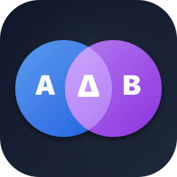

# IndicatorDiff

<p align="center">
  
</p>

두 개의 **Parquet / CSV** 파일, 또는 두 개의 **폴더**를 날짜·컬럼 단위로 비교해서
"무엇이 달라졌는지"를 한 눈에 보여주는 macOS 전용 네이티브 앱.

지표 계산 로직을 리팩터링했을 때, 파이프라인 버전을 바꿨을 때, 백테스트 결과를
재현해야 할 때 **"행 단위로 정말 같은가"** 를 빠르게 확인할 목적으로 만들었다.

---

## 주요 기능

### 파일 모드 — 두 파일을 직접 비교
- `parquet` / `csv` 둘 다 지원 (한쪽이 parquet, 다른 쪽이 csv 조합도 OK)
- 행은 **`date` 컬럼으로 outer join** — 한쪽에만 있는 날짜는 `only in A / only in B` 배지
- **strict / tolerant** 토글:
  - `strict` — bit-exact 비교
  - `tolerant` — `|a-b| ≤ max(abs, rel × max(|a|,|b|))` 판정 (기본 `abs=1e-9`, `rel=1e-6`, 설정에서 조정 가능)
- **NaN / null / 타입 불일치** 각각 별도 상태로 표시
- 3분할 레이아웃:
  1. 좌측 — 다른 날짜 목록 (diff 개수, only-A/B 배지)
  2. 중앙 — 해당 날짜의 컬럼별 diff 요약 (다른 컬럼이 위로 정렬)
  3. 우측 — 선택한 셀의 A 값 / B 값 / Δ (절대·상대 차)

### 폴더 모드 — 두 폴더를 한 번에
- 두 폴더에서 **같은 stem**(확장자 제외한 파일명) 으로 파일 쌍 자동 매칭
- 폴더 안에 같은 stem의 `.parquet` 과 `.csv` 가 동시에 있으면 **parquet 우선** 사용
- 파일 목록은 최초에 `pending` 상태 → **클릭 시 그 쌍만 즉시 비교**
- **Compare All** 버튼으로 일괄 비교 + 진행률 표시 + 중간에 Stop 가능
- 쌍 상태별 카운트 배지: `differ / only-A / only-B / pending / same / error`
- 한쪽 폴더에만 있는 파일은 **A-only / B-only 스위치**로 숨기기 가능

### 세부 편의 기능
- **툴팁 · 상태 표시줄** 으로 전체 경로 언제나 확인 가능
- 슬롯 / 파일 행 / 경로 표시줄에서 우클릭 → **Finder에서 보기** / **경로 복사**
- **비교 히스토리** (최근 50건)
  - UserDefaults + security-scoped bookmark로 영구 저장 — 앱을 껐다 켜도 유지
  - 클릭 한 번으로 예전 비교를 그대로 복원
- **Settings** (⌘,) 에서 tolerance 값 세밀 조정
- **Drag & Drop** 지원 (파일 / 폴더 드롭 → 자동 로드)
- Dock / Finder 에서 식별 가능한 전용 앱 아이콘 (Venn 다이어그램 스타일)

---

## 빌드

### 요구 조건
- macOS 26.3 이상
- Xcode 26.4 이상
- Apple Developer 계정 (코드 서명용, 개인 Development 계정이면 충분)

### 빌드 순서
```bash
git clone <this-repo-url>
cd IndicatorDiff
open IndicatorDiff.xcodeproj
```

Xcode 에서:
1. `Signing & Capabilities` 탭에서 본인의 **Team** 선택
2. `⌘R` 로 빌드 & 실행

의존성(`DuckDB-Swift`) 은 SPM 으로 자동 해결된다.

### 명령줄 빌드 & 테스트
```bash
# 빌드
xcodebuild -project IndicatorDiff.xcodeproj -scheme IndicatorDiff \
           -configuration Debug -destination 'platform=macOS' build

# 유닛 테스트
xcodebuild -project IndicatorDiff.xcodeproj -scheme IndicatorDiff \
           -destination 'platform=macOS' test
```

---

## 기술 스택

| 레이어 | 사용 기술 |
|---|---|
| UI | SwiftUI (macOS-native), `@Observable` 기반 상태 관리 |
| Parquet / CSV 로더 | [DuckDB-Swift](https://github.com/duckdb/duckdb-swift) (`read_parquet` / `read_csv_auto`) |
| Diff 엔진 | 순수 Swift 함수 (MainActor 격리 없음) |
| 영속화 | `UserDefaults` + security-scoped bookmark |
| 테스트 | Swift Testing (`@Test` 매크로) |
| 배포 | macOS App Sandbox + Hardened Runtime |

### 샌드박스 엔타이틀먼트
```
com.apple.security.app-sandbox
com.apple.security.files.user-selected.read-only
com.apple.security.files.bookmarks.app-scope
```

---

## 프로젝트 구조
```
IndicatorDiff/
├── IndicatorDiffApp.swift        # @main — DiffStore + ComparisonHistory 주입
├── ContentView.swift             # 루트 레이아웃 (모드 라우팅)
├── IndicatorDiff.entitlements
├── Models/
│   ├── ParquetDataset.swift      # 로드된 테이블 표현
│   ├── ColumnBuffer.swift        # 타입별 열 버퍼 (bool/int/double/decimal/string/date/timestamp)
│   ├── CellValue.swift           # 타입-소거된 셀 값
│   ├── DiffResult.swift          # 비교 결과 구조체
│   ├── RowKey.swift              # 행 식별자 (복합키 확장 자리)
│   ├── Tolerance.swift           # strict / tolerant 판정 규칙
│   ├── TableSource.swift         # parquet / csv 구분
│   ├── FilePair.swift            # 폴더 모드의 파일 쌍
│   ├── ComparisonHistory.swift   # 히스토리 + security-scoped bookmark
│   └── LoadError.swift
├── Services/
│   ├── ParquetLoader.swift       # DuckDB로 테이블 로드 + 날짜 컬럼 4-단계 탐색
│   ├── DiffEngine.swift          # 순수 diff 로직 (outer-join, tolerance, NaN/null)
│   └── FolderScanner.swift       # 폴더를 stem 기준으로 매칭
├── State/
│   └── DiffStore.swift           # @MainActor @Observable — 모든 UI 상태
└── Views/
    ├── ToolbarBar.swift
    ├── ModePicker.swift
    ├── FileSlotButton.swift      # 파일 모드 슬롯 + fileImporter + 드롭
    ├── FolderSlotButton.swift    # 폴더 모드 슬롯
    ├── FilePairListView.swift    # 폴더 모드 좌측 파일 쌍 목록
    ├── DateListView.swift        # 파일 모드 좌측 날짜 목록
    ├── ColumnSummaryView.swift   # 중앙 컬럼 diff 요약
    ├── CellDetailView.swift      # 우측 셀 상세 (A / B / Δ)
    ├── PathStatusBar.swift       # 하단 전체 경로 표시줄
    ├── HistoryMenu.swift         # 히스토리 팝오버
    └── SettingsView.swift        # ⌘, 설정 창

IndicatorDiffTests/
└── DiffEngineTests.swift         # 10개 테스트 (strict/tolerant, NaN, null, 타입 불일치 등)
```

---

## 설계 메모

### 동시성 전략
프로젝트는 `SWIFT_DEFAULT_ACTOR_ISOLATION = MainActor` 로 설정되어 있다.
무거운 작업이 MainActor를 점유하지 않도록:
- 값 타입(Models) 과 `DiffEngine` 의 정적 메서드는 **명시적 `nonisolated`**
- `ParquetLoader.load` 호출과 `DiffEngine.diff` 실행은 **`Task.detached(priority: .userInitiated)`** 로 백그라운드 격리
- 폴더 배치 비교에서는 루프 사이에 `Task.yield()` 로 UI 호흡 확보

### 날짜 컬럼 자동 탐색 (4단계)
1. 사용자가 지정한 hint 컬럼명
2. DuckDB 타입이 `DATE` / `TIMESTAMP` 인 첫 번째 컬럼
3. 후보 이름(`date / dt / trade_date / 날짜 / ...`) + 값이 ISO-8601 문자열 또는 `YYYYMMDD` 정수로 파싱 가능
4. 전부 실패 시 `LoadError.dateColumnNotFound` 로 에러

### 보안
- **App Sandbox + Hardened Runtime** 활성 상태에서 동작
- 사용자가 직접 선택한 파일·폴더만 접근 가능
- 히스토리의 경로 재사용을 위해 `.withSecurityScope, .securityScopeAllowOnlyReadAccess` 로 북마크 저장 — 읽기 전용 엔타이틀먼트와 매칭

---

## 개발 상태
현재 MVP. 일상적인 비교 워크플로를 커버하지만 추후 다음이 생각될 수 있다:
- 복합 키(`date` + `ticker`) 비교
- Diff 결과를 CSV / Parquet 로 export
- 초대형 파일 스트리밍 비교
- 특정 컬럼의 A vs B 시계열 차트 뷰
- 다크 모드 대응 아이콘 variant

---

## 라이선스
개인 프로젝트. 필요에 따라 추후 라이선스 명시 예정.
